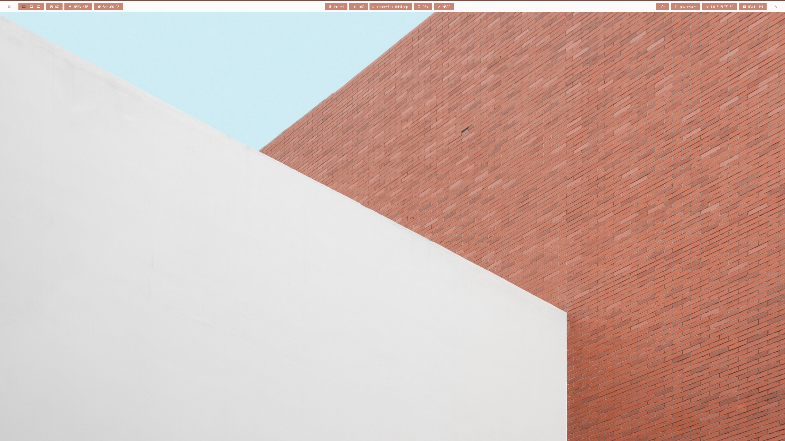
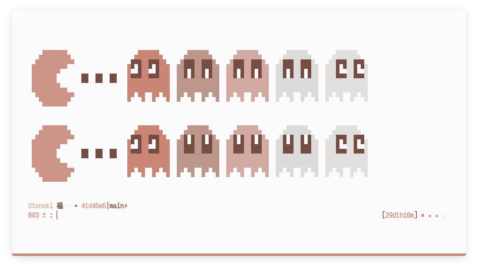
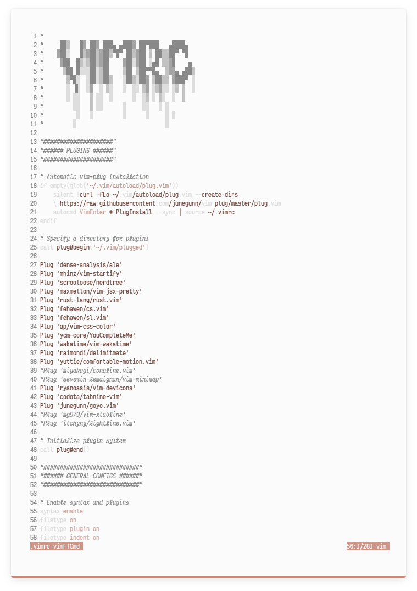
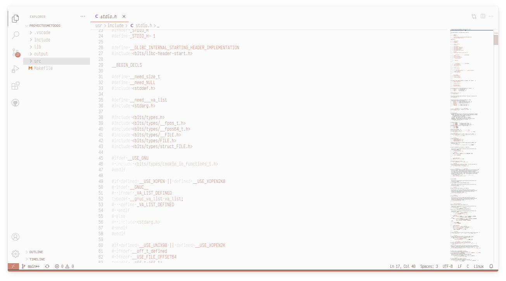
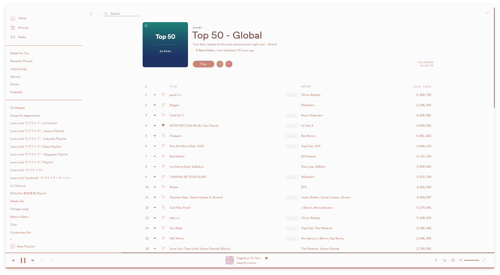
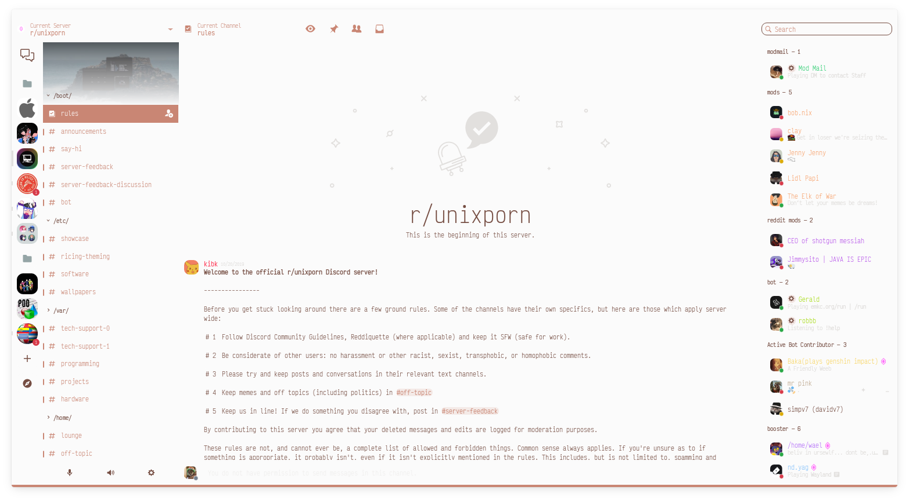
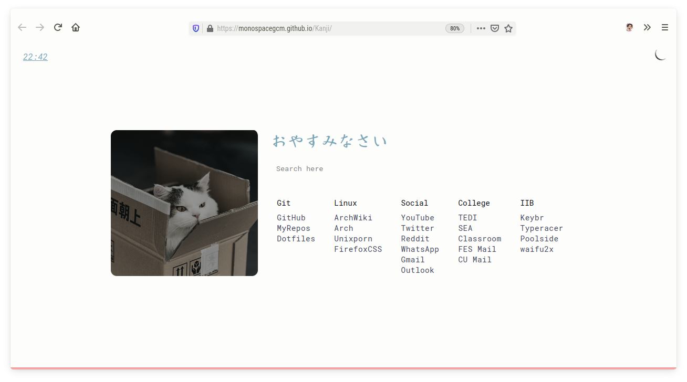

#  _Welcome!_ 

A repo for my current dotfiles. They're made to work with KDE Plasma.

 

---

# Info

Since I use a little script to automatize the process of changen the colors, we need to make sure we have [`Pywal`](https://github.com/dylanaraps/pywal) installed.
I normally use `colorz` as backend but you can use whatever you want.

### Plasma

 I'm using [Lightly](https://github.com/Luwx/Lightly) as Application Style for Plasma. Lightly gives a modern look to the entire desktop and it's customizable. It comes with its own colorscheme which I'm using to make it compatible with `wal`. Lightly comes with its own window decoration which I'm using too.

 ### Bar

 I chose [Polybar](https://github.com/polybar/polybar) as the bar for my desktop. ¿Why I'm not using Plasma panels or Latte Dock? Well, Polybar is by far more customizable than Plasma panels, and Latte Dock is heavy af, The performance of my DE is better when I'm not ussing Panels or Latte.

 I'm using a config from [this repo](https://github.com/adi1090x/polybar-themes). It is probably necessary to make some changes to the configuration file before it can be used optimally.

### Shell

I'm using `zsh` with [oh-my-zsh](https://ohmyz.sh/) to customize it. I'm using `Konsole` as a terminal emulator because I like it and fit with Plasma very well.

  
Click to show Konsole Screenshot

  

### Editor

I'm a young `vim` enthusiast so this is my editor of preference with [Ale](https://github.com/dense-analysis/ale) plugin to set the colorscheme.

  
Click to show Vim Screenshot

  

  Sometimes I use VS Code with [Wal Theme](https://marketplace.visualstudio.com/items?itemName=dlasagno.wal-theme) extension to make it change the colorscheme match the desktop colors.

  
Click to show VS Code Screenshot

  

 ### Spotify

 Spotify is the music player. Spotify is extremely ugly by default so I installed [Spicetify](https://github.com/khanhas/spicetify-cli) to improve its uglyness. I use [this theme](https://github.com/khanhas/google-spicetify) wich looks nice, but I change a file so it works with Pywal too. The theme is included in this repo but it's not a theme made by me.

  
Click to show Spotify Screenshot

  

 ### Discord

 Just like Spotify, Discord is ugly and wants to kill your eyes. In order to prevent this I'm using [BetterDiscord](https://betterdiscord.net/home/) to inject css on it and make it look better. The theme also owrks with the script that set the colors for the Desktop. Its recommended to use that theme, if you want to use another you must do some changes to the script to work with your theme.

 

  
Click to show Discord Screenshot

  

### Steam

I'm also using [wal_steam](https://github.com/kotajacob/wal_steam) wich is in the AUR to customize the aspect of Steam. The script is configured to set a dark theme to Steam no matter what because `wal_steam` looks weird with light themes. I think this can be fixed but I haven't tried to fix it yet.

  
Click to show Steam Screenshot

  

### Startpage

I forked [Kanji](https://github.com/Alededorigo/Kanji) to make my startpage and also using Firefox as web browser.

  
Click to show Firefox Screenshot

  

### Launcher

Launcher is Rofi and the config files are in `.config/polybar/scripts/`

### Others

The next ones are also used:
* `Zathura` (PDF viewer)
* `Neofetch` (You probably know what neofetch does)
* `.toys` (Folder with funny scripts)
* `Wallpapers` (Come on!)

---

# How to use the main script

The script in charge of set the desktop colors is located in `.config/polybar/scripts/rice.sh` you can use it from there. It is also aliased in my `.zshrc` file as `rice`. It's very easy to use. You just need to invoke the script and pass it a wallpaper of your choice with `-i` flag. If you want it to generate a light color scheme make sure to use `-l`. Use `-b` to select one of the pywal backends (Make sure to installed them first). I'll improve the script later because for now it is a little ~~bit~~ much crappy.

### Examples

Basic example to generate a Dark colorscheme

    sh .config/polybar/scripts/rice.sh -i path/to/your/wallpaper

or using the alias

    rice -i path/to/your/wallpaper

  
View example

  
  

 And for a light colorscheme we send a second parameter

    sh .config/polybar/scripts/pywal_Complete.sh -l -i path/to/your/wallpaper

  
View example

  

Generate a light color scheme using colorz as backend:

    rice -i path/to/your/wallpaper -l -b colorz

`wal` its the default backkend and it'll be used whe no backend is specified.

 The script will change the colors for Plasma, Spotify, Discord, Zathura, Konsole, Firefox, Rofi, Steam, VS Code(sometimes you need to refresh the theme manually) and will set the image as Desktop Background. When you run this script it will display the `Colors` kcmshell5 module. You will need to Apply any other colorscheme other than the lightly-wal and then reapply it because a haven't found a way to make to Plasma to realize that the colors have changed. If you dont do this the Plasma colors will not change until you do it, reboot or re-login.

Make sure to have `xsettingsd` installed to refresh the Gtk theme on the fly, if not you will need to close and open your apps to see the changes.

When changing the colors Konsole will not update its color - at least not in a correct way - but this is a Konsole issue. The script and wal can't do anything about it for now. [See here](https://github.com/dylanaraps/pywal/wiki/Customization#konsole)

If the path to your wallpaper has spaces the script might show a weird behaviour. It can not generate the colorscheme or not set the wallpaper. A path and a file name without spaces is recommended.

---

# Dependencies

* xsettingsd
* wal_steam
* EnhancedDiscord
* Pywal
* Polybar

---
# Installation 

_Someday, I hope so._